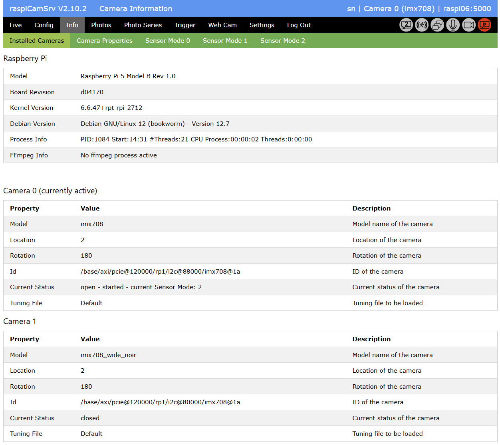
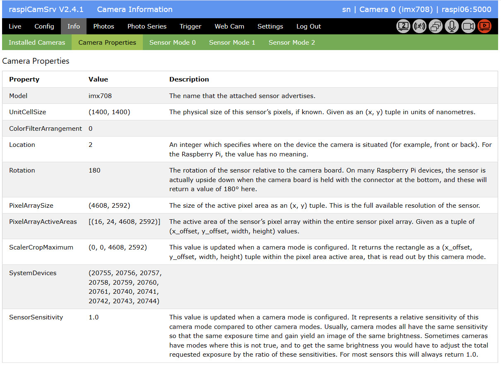

# raspiCamSrv Information on Camera System

[](./UserGuide.md)

This screen contains several tabs with information on the camera system:

## Cameras



### Raspberry Pi

This section shows information on the server hardware with *Model* and *Board Revision*

*Process Info* shows current process information for the raspiCamSrv server process (result of Linux ```ps -eLf``` command)
- *PID*: Process ID of Flask process (PID)
- *Start*: Process start time (STIME): either start time (HH:MM) at current day or day (MonDD) when process was started.
- *#Threads*: Number of threads (NLWP)
- *CPU Process*: CPU time of process (TIME for LWP == PID) in HH:MM:SS
- *CPU Threads*: Sum of CPU time for threads ((TIME for LWP != PID)) in %H:MM:SS

*FFmpeg Info* shows information on an ffmpeg process if encoding of .mp4 videos is currently active.   
Recording of .mp4 videos may have been [started manually](./Phototaking.md) or as an action within [motion capturing](./Trigger.md)

### Camera x

The tab lists all cameras currently connected to the system.

Each camera has an identifying number (0, 1, ...) shown in the title above each parameter list.

**raspiCamSrv** detects also USB cameras, however, these are not supported, which is indicated in the title.

When the server starts up, the first camera, which is not a USB camera, is selected.

You may later switch to another non-USB camera on the [Settings](./Settings.md) screen or the [Web Cam](./Webcam.md) screen

The active camera is indicated in the list.

The active camera will also be shown in the title bar of the application after log-in.

*Current Status* shows the status of the camera:
- open / closed
- started / stopped
- current [Sensor Mode](#sensor-modes)   
This is only shown for the currently active camera if it is started.    
If the Sensor Mode cannot currently be determined, 'unknown' is shown.    
The Sensor Mode is usually automatically selected by the camera and normally corresponds to the largest [Stream Size](./Configuration.md#stream-size-width-height), requested by one of the [Camera Configurations](./Configuration.md).

See [Camera Status and Number of Threads](#camera-status-and-number-of-threads)

Under *Tuning File*, you can see whether the Default or a custom tuning file are currently in use.    
See [raspiCamSrv Camera Tuning](./Tuning.md).

## Camera Properties



These are the properties of the camera which is currently active.

Information is only shown if the camera is currently open.    
If the list is empty because the camera is closed, open the *Live* screen with the live view which will open the active camera.   
Then switch to the *Info* screen within 10 seconds.

## Sensor Modes

The camera system advertises the supported Sensor Modes with their characteristics.

These are referred to within the [Camera Configuration](./Configuration.md).

The characteristics vor every Sensor Mode are shown on an individual tab:


## Camera Status and Number of Threads

The number of threads used by the server process depends on the status of the camera(s).

- When all cameras are closed, there is just the server process and, in case of Bookworm systems, 2 threads which are started with the import of Picamera2.    
Thus, there is a minimum of three threads (1 for Bullseye).
- Opening a camera starts additional threads which remain active while the camera is open.   
The number of threads may depend on the camera infrastructure specific for the operating system.
- Starting a camera and/or starting an encoder starts additional threads depending on the chosen camera function and encoder.
- **raspiCamSrv** also uses threads for background processes, such as live stream, video recording, photo series and motion detection. These ramain active while these processes are running.
- Stopping and closing a camera will also stop the dependent threads and thus reduce the number of active threads.
- If .mp4 video is currently recorded ([started manually](./Phototaking.md) or as an action within [motion capturing](./Trigger.md)), there will be an additional ffmpeg process with additional threads.
- In case of .mp4 video recording with H264Encoder and FfmpegOutput there seems to be an issue with threads:    
In this case, there may be threads surviving when the encoder is stopped (see [picamera2 Issue #1023](https://github.com/raspberrypi/picamera2/issues/1023)).   
So, when .mp4 videos have been recorded, the number of threads may not go down to 3 (1 for Bullseye) after all camaras have been closed.   
Experience shows that such threads may survive for a longer time but typically, they show only minor or no CPU utilization.   
Often, they vanish after the camera has been closed after live stream has stopped.

**raspiCamSrv** closes the camera in case it is not used:

- When the [live stream](./LiveScreen.md) stops after 10 seconds of inactivity, the camera used for the live stream will be stopped and closed.
- After [photos have been taken or videos have been recorded](Phototaking.md), the camera will be stopped and closed.
- For [Photo Series](./PhotoSeries.md), the camera will be stopped and closed after a shot if the interval to the next shot is >60 sec.   
This does not apply to [Exposure Series](./PhotoSeriesExp.md) and [Focus Stacks](./PhotoSeriesFocus.md).
- If [motion detection](./Trigger.md) is active, the live stream is kept activated which keeps the camera open and started.

