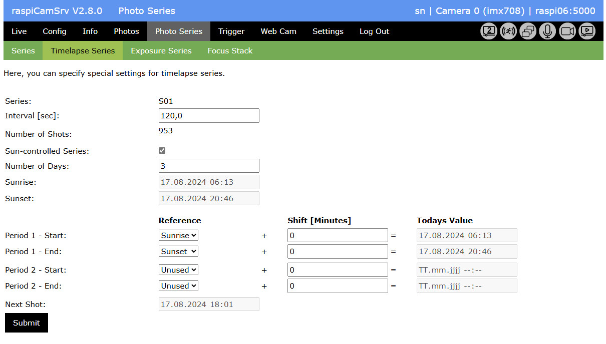
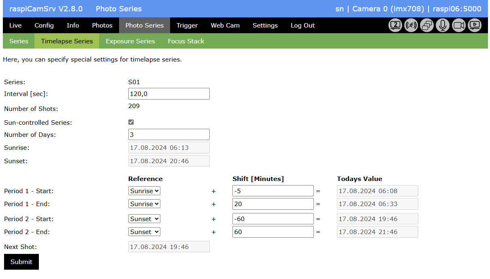

# Photo Series of Type "Timelapse"

This screen allows special configurations for Photo Series in the Timelapse domain.    
Of course, every normal Photo Series can be used for Timelapse purposes. However, users often require specific features like specific time slots for multi-day series or automatic exposure adjustment during sunset/sunrise phases (Autoramping / "Timelapse Holy Grail").

This page is dedicated to this kind of configuration settings.   
Currently, raspiCamSrv supports limiting photo shooting to configurable periods depending on sunrise and sunset.

Usage of this feature requires calculation of sunrise and sunset, depending on date.    
The algorithm (see [Sunrise Equation](#sunrise-equation)) requires information about the geografic coordinates of the camera position.   
These need to be specified on the [Settings](./Settings.md) screen before a Series can be classified as "Sun-controlled".   
It is recommended to [store the configuration](./Settings.md#server-configuration-storage) in order to have these settings available after a server restart.

When this screen is activated after a [new Series](./PhotoSeries.md#creation-of-a-new-series) has been created, it will show up as

- The fields **Series**Name, **Interval** and **Number of Shots** refer to the same parameters as screen [Series](./PhotoSeries.md).
- Activating the checkbox **Sun-controlled Series** will activate selective photo shooting in periods depending on sunrise and/or sunset.
- You can specify the **Number of Days** for which the series shall be active
- The fields **Sunrise** and **Sunset** will show values for the current day. If the series will be running for several days, sunrise and sunset will be calculated individually for every day.
- The system allows the definition of two periods per day during which photos will be shot with the given **Interval**: These are named **Period 1** and **Period 2**
- At least for **Period 1**, you need to specify **Start** and **End** If only one is specified, the system reports an error and does not persist the specified data. **Start** and **End** are specified if the **Reference** is not "Unused".
- The **Reference** specifies whether "Sunrise" or "Sunset" will be used to limit the intended period.
- For each **Period**s **Start** and **End**, you can specify a time **Shift** in Minutes by which the start or the end of the period will be shifted with respect to the selected **Reference**. The **Shift** can be positive or negative.
- After **Submit**, the system will calculate **Todays Values** for **Start** and **End**.
- Also the time for the **Next Shot** will be shown.

When submitting entries with a reasonable interval and Number of Days, the system will recalculate the required **Number of Shots** as well as the expected **End** of the Series, shown on the [Series](./PhotoSeries.md) screen.

## Example: Single Period for Daylight Photos

## Example: Two Periods around Sunrise and Sunset

## Sunrise Equation

The algorithm for the sunrise/sunset equation has been taken from Wikipedia:   
[https://en.wikipedia.org/wiki/Sunrise_equation](https://en.wikipedia.org/wiki/Sunrise_equation)

This article also publishes Python code which has been taken as is (version from August 11, 14:18) and integrated with minor technical adjustments into the RaspiCamSrv Flask server code.

Comparison of the results from this algorithm with those from the "NOAA Solar Calculator" ([https://gml.noaa.gov/grad/solcalc/](https://gml.noaa.gov/grad/solcalc/)) for the time of writing at the author's location showed a deviation of -2 Minutes for sunrise and +3 Minutes for sunset.   
However, the NOAA Calculator does not seem to take elevation into account.