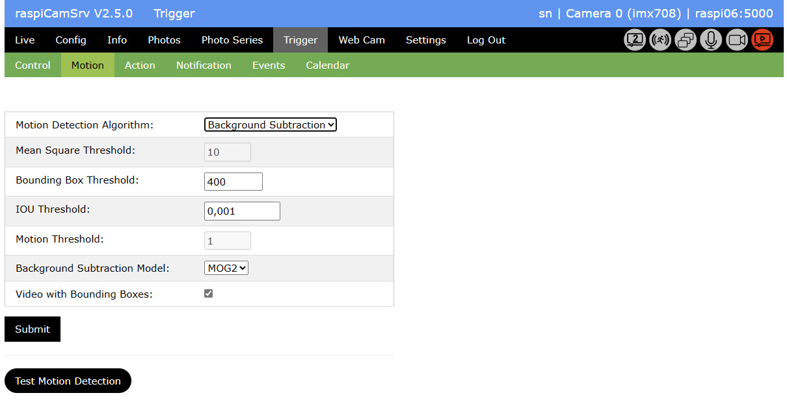
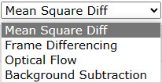

# Triggered Capture of Videos and Photos

# Motion Capturing

With Motion Capturing, you may trigger actions in case that **raspiCamSrv** has detected changes in the visual area of the active camera.    
Sensitivity of detection is strongly dependent on the algorithm used for detection.

**raspiCamSrv** currently supports 4 different algorithms:
- *Mean Square Difference* between pixel color levels of successive frames.
- *Frame Differencing*
- *Optical Flow*
- *Background Subtraction*

The latter 3 variants are implementations of algorithms proposed by Isaac Berrios in [Introduction to Motion Detection](https://medium.com/@itberrios6/introduction-to-motion-detection-part-1-e031b0bb9bb2).

Whereas the *Mean Square Difference* is available in general, the other algorithms require [special preconditions for Extended Motion Capturing](./Settings.md#extended-motion-detection-support).

## Motion Detection Configuration

This section allows specification of motion capturing aspects:

- *Motion Detection Algorithm* allows selecting the algorithm by which the system will recognize motion through its camera.   
    
Depending on the selected algorithm, the relevant parameters are editable and can be adjusted.
- *Mean Square Threshold* is the value of the mean square difference above which the system detects a motion event.
- *Bounding Box Threshold* is the threshold for acceptable conrour sizes (see [IB-1](https://medium.com/@itberrios6/introduction-to-motion-detection-part-1-e031b0bb9bb2))
- *IOU Threshold* is the Threshold for "Intersection Over Union or IOU" of overlapping bounding boxes (see [IB-1](https://medium.com/@itberrios6/introduction-to-motion-detection-part-1-e031b0bb9bb2))
- *Motion Threshold* is the minimum flow threshold for motion used in *Optical Flow* algorithm (see [IB-2](https://medium.com/@itberrios6/introduction-to-motion-detection-part-2-6ec3d6b385d4))
- *Background Subtraction Model* is the model used for generating a background model in *Background Subtraction* algorithm. (see [IB-3](https://medium.com/@itberrios6/introduction-to-motion-detection-part-3-025271f66ef9))
- *Video with Bounding Boxes* allows selection of the type of video recorded for a motion event, if activated on the [Control](./Trigger.md#control) tab.   
If activated, the video will show bounding boxes around areas for which motion has been detected.   
Otherwise, normal videos will be recorded.

Any changes must be submitted with the **Submit** button.   
Changes will be effective after the Motion Capturing Process has been started the next time.

## Testing Motion Capturing

In order to optimize the parameters for the intended application, **raspiCamSrv** allows test runs for the selected algorithm (except for *Mean Square Difference*).    
During a test run, no events are generated. Instead, a preview of different aspects of the chosen algorithm is shown.    
Detected motion events are indicated by the occurrence of bounding boxes.    
An active test run is indicated by the turquoise status indicator.

### Test for *Frame Differencing* Algorithm

For a detailed description of this algorithm, see [Introduction to Motion Detection: Part 1](https://medium.com/@itberrios6/introduction-to-motion-detection-part-1-e031b0bb9bb2) by Isaac Berrios.

### Test for *Optical Flow* Algorithm

For a detailed description of this algorithm, see [Introduction to Motion Detection: Part 2](https://medium.com/@itberrios6/introduction-to-motion-detection-part-2-6ec3d6b385d4) by Isaac Berrios.

### Test for *Background Subtraction* Algorithm

For a detailed description of this algorithm, see [Introduction to Motion Detection: Part 3](https://medium.com/@itberrios6/introduction-to-motion-detection-part-3-025271f66ef9) by Isaac Berrios.

This algorithm can normally be expected to give best results.   
The fact that the shown example has a lower quality compared to *Optical Flow* may be attributed to the 'stationary' movement of the object which 'burns' itself into the background model because each frame contributes to the model.

### Performance

The performance requirements for the different algorithms have an impact on the frame rates which can be achieved during testing and an active Motion Capturing process.    

In order to get information on the frame rates, these are measured during a test and displayed at the bottom of the screen.   
Reliable values can only be obtained after the test has run some time. Therefore, it is necessary to refresh the screen using the button aside of the displayed value.

### Recorded Videos

If the option to record videos with bounding boxes has been chosen, the videos are generated frame by frame within the algorithm.   
The framerate needs to be specified before frames are added to the video.    
Currently, the video is started when a motion event has been detected (final number of detected bounding boxes > 0). However, at this time, the real frame rate is not yet known. Therefore a rough estimate is used for the individual algorithms which is close to the values shown in figures, above.

This results in videos with motion speed close to real life.

If, however, the achieved rates on a specific system differ from these values, the video speed may be timelapse slow-motion.
